# 程序简介

## 功能

在地图中使用A*算法寻找给定的两点之间的路径。

## 输入

程序会从文件中读取地图信息，输入为一个文件名。程序读时采用相对路径来查找文件。输入为一个文件名。

### 文件内容格式

“*”代表该节点可以通过，“#”代表该节点为障碍物不可通过。节点之间用空格分隔。

## 编译运行

在项目目录下新建一个build目录，进入该目录使用cmake工具编译该项目。编译后生成的可执行文件存放在build/bin文件夹下。

命令如下：

```shell
mkdir build
cd build
cmake ..
make 
sudo make install // install program to /usr/local/bin
./bin/main
./bin/gtest
```

# 类图



# 流程图


